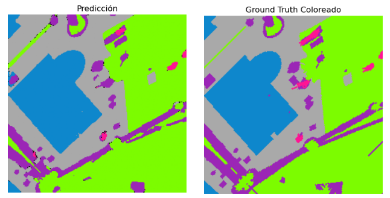

# Segmentación de imágenes urbanas de un dron mediante Deep Learning

## Resumen del Proyecto

El campo de la Inteligencia Artificial está adquiriendo una relevancia considerable en diversos ámbitos y sectores de la sociedad. Uno de ellos donde la Inteligencia Artificial ha destacado significativamente es en la clasificación de imágenes y detección de objetos dentro de las mismas. Gracias a estos avances, se ha conseguido desarrollar aplicaciones tan dispares como conducción autónoma, diagnóstico médico o automatización industrial.

Este trabajo explora el área de la Visión por Computador para la detección de zonas de aterrizaje seguras para drones empleando la segmentación de imágenes urbanas. El propósito principal es presentar tanto el marco teórico como práctico para desarrollar este modelo de segmentación de imágenes. Se utilizan técnicas de Deep Learning (Aprendizaje Profundo), en particular, Redes Neuronales Convolucionales, bajo la arquitectura conocida como UNET. Aunque los resultados obtenidos alcanzan una alta precisión, es importante mencionar que no se puede asumir como una solución única y definitiva.

Finalmente, el trabajo se complementa con una aplicación web que permite utilizar el sistema de detección de zonas de aterrizaje de forma eficiente y sencilla. Con ello, una persona puede supervisar y analizar los resultados obtenidos por la aplicación y proporcionar una cierta explicación de los mismos.

## Resultados 

El modelo final ha demostrado conseguir una precisión de clasificación realmente alta, consiguiendo un 94.07% sobre el conjunto de prueba. Durante el entrenamiento logra un 97.45% de precisión sobre las imágenes del conjunto de entrenamiento. 

En la siguiente imagen observamos la evolución de la precisión a lo largo de las diferentes épocas de entrenamiento:

Con las precisiones alcanzadas durante el entrenamiento, observamos resultados segmentados con una elevada tasa de acierto. Para una imagen del conjunto de prueba seleccionada de forma aleatoria conseguimos los siguientes resultados:

## Versiones de las herramientas

Comandos y versiones de instalación de las bibliotecas necesarias para evitar problemas de compatibilidades entre versiones.

- Pytorch (versión 2.0.1):
`conda install pytorch`

- Torchvision (versión 0.15.2)
`conda install torchvision`

- tqdm (versión 4.65.0)
`conda install tqdm`

- OpenCV (versión 4.8.1.78)
`pip install opencv-contrib-python`

## Instalación de Docker

La versión de Docker instalada es la 24.0.7. Se incluyeron las versiones 0.11.2 de Docker Buildx y 2.21.0 de Docker Compose, como los principales plugins. 

Éstos son los pasos detallados para la instalación:

1. Primero actualizamos el sistema antes de instalar ningún nuevo paquete, ejecutando el comando:
   `sudo apt-get update`
   
2. Instalamos Docker, a través del comando `sudo apt-get install docker-ce`. Importante tener en cuenta la versión de sistema operativo.

3. Instalación de los plugings. `sudo apt-get install docker-buildx-plugin docker-compose-plugin`.

## Autor y contacto

Autor: Carlos Martín Sanz

Correo Electrónico: carlosmsanz7@gmail.com

